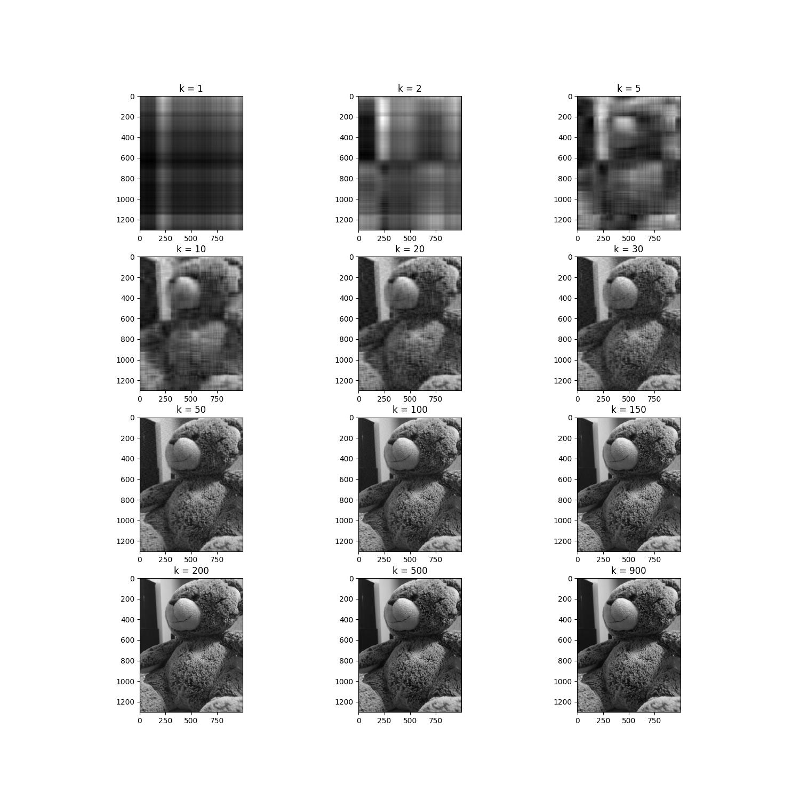

# CSE472 Machine Learning Sessional

## Assignment 1: Transformation matrices, Eigen Decomposition and low rank approximation using SVD
### Problem 1: Transformation matrices
In this task, we derived the transformation matrix that would transform 2 vectors to 2 other vectors. The transformation matrix is given by:
$$
\begin{bmatrix}
    -0.5 & 1 \\
    1 & 0
\end{bmatrix}
$$
The transformation matrix is derived by multiplying the inverse of the matrix formed by the 2 vectors to the matrix formed by the 2 other vectors.
### Problem 2: Eigen Decomposition
we generated random invertible matrices and random symmetric invertible matrices and reconstructed them from their eigen decomposition.
#### Generating and ensuring the invertibility of the matrices
An invertible matrix can be generated by applying random elementery row operations on the identity matrix. The determinant will be non-zero. And a symmetric matrix can be generated by multiplying a matrix with its transpose. if the original matrix is invertible, the symmetric matrix will also be invertible. 
### Problem 3: low rank approximation using SVD
We reconstructed a greyscale image from its low rank approximation using SVD. The resulting images with varying K values are shown below:

### What I had to learn
* Finding algorithms that ensure the invertibility of a matrix
* Finding algorithms that ensure the symmetry of a matrix
* Making image storage efficient using low rank approximation (k(m+n+1) space instead of mn space)
## Assignment 2: 
### What I had to learn
* When to use min-max scaling and when to use standard scaling
* When to use one hot encoding and when to use label encoding
    * if test data does not hold a categorical value that is present in the training data, one hot encoding will fail
      as is the case with {'native-country_Holand-Netherlands'} in the adult dataset
* Removing outliers and handling imbalanced data 
* credit card data outliers are the real deal 

### useful links:
[Solvers for library models](https://stackoverflow.com/questions/38640109/logistic-regression-python-solvers-definitions/52388406#52388406)
[Numeric feature scaling](https://scikit-learn.org/stable/modules/preprocessing.html)
## Assignment 3: