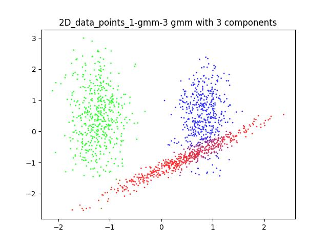

# CSE472 Machine Learning Sessional

## Assignment 1: *Transformation matrices*, *Eigen Decomposition* and *Low Rank Approximation* using SVD
### Transformation matrices
In this task, we derived the transformation matrix that would transform 2 vectors to 2 other vectors. The transformation matrix is given by:
$$
\begin{bmatrix}
    -0.5 & 1 \\
    1 & 0
\end{bmatrix}
$$
The transformation matrix is derived by multiplying the inverse of the matrix formed by the 2 vectors to the matrix formed by the 2 other vectors.
### Eigen Decomposition
We generated random invertible matrices and random symmetric invertible matrices and reconstructed them from their eigen decomposition.
#### Generating and ensuring the invertibility of the matrices
An **invertible matrix** can be generated 
- by applying random elementery row operations on the identity matrix. The determinant will be non-zero.

And a **symmetric matrix** can be generated 
- by multiplying a matrix with its transpose. if the original matrix is invertible, the symmetric matrix will also be invertible.\
$
Det(A\cdot A^T) = Det(A)\cdot Det(A^T) = Det(A)\cdot Det(A) = (Det(A))^2
$
#### Reconstructing the matrices
A matrix can be reconstructed from its eigen decomposition by the following formula:\
$
A = X\cdot \lambda \cdot X^{-1}
$

where X is the matrix formed by the eigenvectors of A and $\Lambda$ is the diagonal matrix formed by the eigenvalues of A.
- To decompose the invertible matrix, the `numpyp.linalg.eig` function was used.
- To decompose the symmetric invertible matrix, the `numpy.linalg.eigh` function was used. Because `eigh` uses a faster algorithm that takes advantage of the fact that the matrix is symmetric.  

### Low Rank Approximation using SVD
We reconstructed a greyscale image from its low rank approximation using SVD. The resulting images with varying K values are shown below:

### What I had to learn
* Finding algorithms that ensure the invertibility of a matrix
* Finding algorithms that ensure the symmetry of a matrix
* Making image storage efficient using low rank approximation (k(m+n+1) space instead of mn space)
## Assignment 2: *Data Preprocessing*, *Logistic Regression* and *AdaBoost* from scratch
In this assignment, we had to implement logistic regression and adaboost from scratch and train them on 3 different datasets. The datasets were preprocessed and the models were trained and tested on them. The task was to
- Preprocess the data
    - Remove outliers
    - Handle missing values
    - Handle imbalanced data
    - Scale the data
    - Encode the categorical data
- Implement logistic regression and adaboost **from scratch**
- Train and test the models on the datasets
    - With Logistic Regression
    - With AdaBoost (Ensemble of weak Logistic Regression models)
- Compare the results with the results Between the Logistic Regression and AdaBoost model

### Datasets
- [Telco Customer Churn](https://www.kaggle.com/datasets/blastchar/telco-customer-churn)
- [Adult](https://archive.ics.uci.edu/dataset/2/adult)
- [Credit Card Fraud Detection](https://www.kaggle.com/mlg-ulb/creditcardfraud)
#### How to set up the dataset

The dataset should be arranged in the following way:

```
1805074.pdf
1805074.py
datasets
├──adult.data
├──adult.names
├──adult.test
├──creditcard.csv
├──Index
├──old.adult.names
├──WA_Fn-UseC_-Telco-Customer-Churn.csv
```

### Telco Customer Churn Dataset Performance
| Name | Value |
|----------|----------|
| Gradent Descent strategy    | Vanilla    |
| Decay strategy    | inverse    |
| Error Threshold    | 0.5    |
| Epochs    | 1000    |
| Top features    | 5    |
| Initial learning rate  | 0.1    |

#### Weak Learner Performance
| Performance Measure | Training | Test |
|---------------------|----------|------|
| Accuracy            |    0.73813      |   0.73774   |
| Recall              |    0.01672      |   0.01604   |
| Specificity         |    0.99927      |   0.99903   |
| Precision           |    0.89286      |   0.85714   |
| FDR                 |    0.10714      |   0.14286   |
| F1 Score            |    0.03283      |   0.03150   |
                                     

#### AdaBoost Performance
| Number of boosting rounds | Training | Test |
|-------------------|----------|------|
| K = 5             |  0.78293   |  0.78252   |
| K = 10            |  0.77387   |  0.78109   |
| K = 15            |  0.75484   |  0.75551   |
| K = 20            |  0.75751   |  0.75480   |

### Adult Dataset Performance
| Name | Value |
|----------|----------|
| Gradent Descent strategy    | Vanilla    |
| Decay strategy    | inverse    |
| Error Threshold    | 0.5    |
| Epochs    | 1000    |
| Top features    | 5    |
| Initial learning rate  | 0.1    |

#### Weak Learner Performance
| Performance Measure | Training | Test |
|---------------------|------------|------|
| Accuracy            |  0.76298   |  0.76620  |
| Recall              |  0.05155   |  0.05189  |
| Specificity         |  0.99876   |  0.99886  |
| Precision           |  0.93253   |  0.93659  |
| FDR                 |  0.06747   |  0.06341  |
| F1 Score            |  0.09769   |  0.09834  |


#### AdaBoost Performance
| Number of boosting rounds | Training | Test |
|---------------------|----------|------|
| K = 5             |   0.75280       |  0.75684    |
| K = 10            |   0.75280       |  0.75684    |
| K = 15            |   0.75280       |  0.75684    |
| K = 20            |   0.77850       |  0.78035    |

### Credit card Dataset Performance
| Name | Value |
|----------|----------|
| Gradent Descent strategy    | Vanilla    |
| Decay strategy    | inverse    |
| Error Threshold    | 0.5    |
| Epochs    | 1000    |
| Top features    | 5    |
| Initial learning rate  | 0.1    |

#### Weak Learner Performance
| Performance Measure | Training | Test |
|---------------------|-----------------|-------------|
| Accuracy            |   0.99504       |   0.99430   |
| Recall              |   0.80856       |   0.76842   |
| Specificity         |   0.99975       |   0.99975   |
| Precision           |   0.98769       |   0.98649   |
| FDR                 |   0.01231       |   0.01351   |
| F1 Score            |   0.88920       |   0.86391   |


#### AdaBoost Performance
| Number of boosting rounds | Training | Test |
|-------------------|-------------|-----------|
| K = 5             |  0.99504    |  0.99430  |
| K = 10            |  0.96660    |  0.96580  |
| K = 15            |  0.92675    |  0.92169  |
| K = 20            |  0.93661    |  0.93804  |

### What I had to learn
* When to use min-max scaling and when to use standard scaling
* When to use one hot encoding and when to use label encoding
    * if test data does not hold a categorical value that is present in the training data, one hot encoding will fail
      as is the case with {'native-country_Holand-Netherlands'} in the adult dataset
* Removing outliers and handling imbalanced data 
* The outliers in the Credit Card dataset should not be removed because they are **most likely the frauds** that we are trying to detect


### useful links:
- [Solvers for library models](https://stackoverflow.com/questions/38640109/logistic-regression-python-solvers-definitions/52388406#52388406)
- [Numeric feature scaling](https://scikit-learn.org/stable/modules/preprocessing.html)

## Assignment 3: *Feed Forward Neural Network* from scratch
In this assignment we had to implement a neural network from scratch and train it on the MNIST alphabet dataset. The trained model architecture and weights had to be saved for later use. The task was to
- Implement a feed forward neural network from scratch with support for
    - Dense Layers
    - Activation layers (ReLU, Sigmoid, Softmax, Tanh)
    - Initializers (Xavier, He, Lecun)
    - Dropout layers
    - Optimizers
- Build different Architectures and train them on the EMNIST dataset
- Report the performance of the models (Accuracy, Precision, Recall, F1 Score, Confusion Matrix)
- Save the model architecture and weights for later use

### Dataset
To download the training dataset, the following code was used:
```python
train_validation_dataset = ds.EMNIST(root='./data', split='letters',
train=True,
transform=transforms.ToTensor(),
download = True)
```
for downloading the test dataset, the following code was used:
```python
independent_test_set = ds.EMNIST(root='./data', split='letters',
train=False,
transform=transforms.ToTensor(),
download = True)
```
### Results 
#### Architecture used
```
Dense Layer: (784,464)
Initializer:Xavier
Activation: Sigmoid
Dropout: 0.7

Dense Layer: (464,348)
Initializer:He
Activation: ReLU
Dropout: 0.52

Dense Layer: (348,26)
Initializer:Xavier
Activation: Softmax

Loss: Cross Entropy Loss
```

#### Performance of the model
| Performance Measure | Value |
|---------------------|-------|
| Accuracy            | 95.29%|
| Validation Accuracy | 92.28%|
| Training Loss       | 0.135 |
| Validation Loss     | 0.233 |
| Validation Macro F1 | 0.922 |


### What I had to learn
* backpropagation from scratch
* importance of learning how to tune hyperparameters
* __call__, __str__
* saving a model architecture along with it's weights
* how to avoid overfitting


## Assignment 4: *Principal Component Analysis* and *Expectation Maximization (EM) Algorithm* visualization
### Problem statement:
In this problem, we are given a dataset of **2, 3, 6 and 100 dimensional data** that was generated from a **gaussian mixture model**. \
The task was to 
- **apply Principal Component Analysis (PCA)** to the dataset and visualize the data in 2D. 
- **apply Expectation Maximization (EM) algorithm** on the 2 dimensional data to estimate the gaussian mixture model parameters used to generate the data.
    - The EM algorithm was implemented from scratch.
    - For each dataset, a guess was made for how many gaussian components were used to generate the data *from 3 to 8*
    - for each guessed number of components, the EM algorithm was run *5 times for 100 iterations* and the model with the highest log likelihood was chosen.
- **visualize the EM algorithm** by plotting the data and the estimated gaussian mixture model parameters at each iteration.

### Results
#### 2 Dimensional data
The dataset is in [this](offline-4-pca/data/2D_data_points_1.txt) folder.\
The PCA reduced 2D data points are shown below:

The visualization of the EM algorithm for *3 components* is shown below:

the resulting clusters after 100 iterations are shown below:

#### 3 Dimensional data
The dataset is in [this](offline-4-pca/data/3D_data_points.txt) folder.\
The PCA reduced 3D data points are shown below:

The visualization of the EM algorithm for *4 components* is shown below:

the resulting clusters after 100 iterations are shown below:


#### 6 Dimensional data
The dataset is in [this](offline-4-pca/data/6D_data_points.txt) folder.\
The PCA reduced 6D data points are shown below:

The visualization of the EM algorithm for *5 components* is shown below:

the resulting clusters after 100 iterations are shown below:


#### 100 Dimensional data
The dataset is in [this](offline-4-pca/data/100D.txt) folder.\
The PCA reduced 100D data points are shown below:

The visualization of the EM algorithm for *3 components* is shown below:

the resulting clusters after 100 iterations are shown below:


The other generated plots can be found in these links : 
1. [gifs](offline-4-pca/assets/gifs/).
2. [plots](offline-4-pca/assets/plots/).
3. [log-likehoods](offline-4-pca/assets/log_likelihoods/)

## Useful links
[A very good intro to SVD and PCA](https://web.stanford.edu/class/cs168/l/l9.pdf)