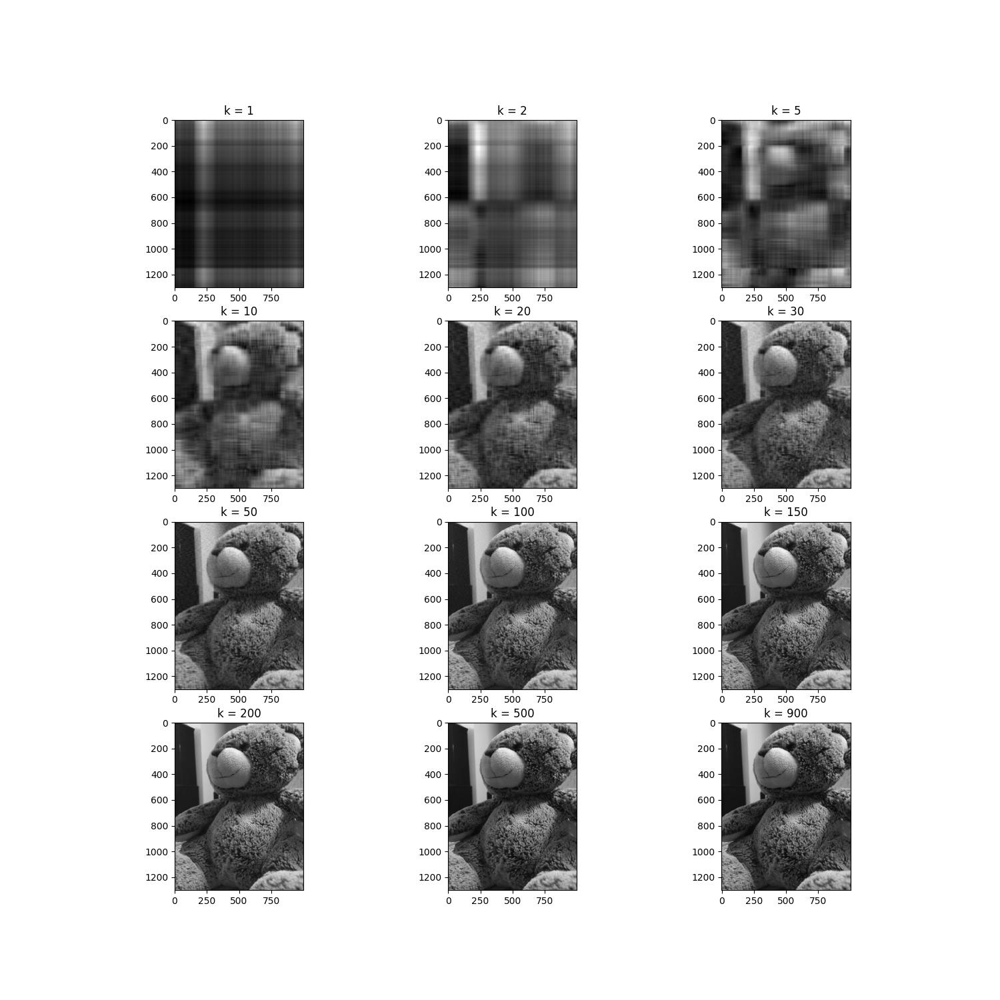

## *Transformation matrices*, *Eigen Decomposition* and *Low Rank Approximation* using SVD
### Transformation matrices
In this task, we derived the transformation matrix that would transform 2 vectors to 2 other vectors. The transformation matrix is given by:
$$
\begin{bmatrix}
    -0.5 & 1 \\
    1 & 0
\end{bmatrix}
$$
The transformation matrix is derived by multiplying the inverse of the matrix formed by the 2 vectors to the matrix formed by the 2 other vectors.
### Eigen Decomposition
We generated random invertible matrices and random symmetric invertible matrices and reconstructed them from their eigen decomposition.
#### Generating and ensuring the invertibility of the matrices
An **invertible matrix** can be generated 
- by applying random elementery row operations on the identity matrix. The determinant will be non-zero.

And a **symmetric matrix** can be generated 
- by multiplying a matrix with its transpose. if the original matrix is invertible, the symmetric matrix will also be invertible. 
$$
Det(A\cdot A^T) = Det(A)\cdot Det(A^T) = Det(A)\cdot Det(A) = (Det(A))^2
$$
#### Reconstructing the matrices
A matrix can be reconstructed from its eigen decomposition by the following formula:
$$
A = X\cdot \lambda \cdot X^{-1}
$$

where X is the matrix formed by the eigenvectors of A and $\Lambda$ is the diagonal matrix formed by the eigenvalues of A.
- To decompose the invertible matrix, the `numpyp.linalg.eig` function was used.
- To decompose the symmetric invertible matrix, the `numpy.linalg.eigh` function was used. Because `eigh` uses a faster algorithm that takes advantage of the fact that the matrix is symmetric.  

### Low Rank Approximation using SVD
We reconstructed a greyscale image from its low rank approximation using SVD. The resulting images with varying K values are shown below:

### What I had to learn
* Finding algorithms that ensure the invertibility of a matrix
* Finding algorithms that ensure the symmetry of a matrix
* Making image storage efficient using low rank approximation (k(m+n+1) space instead of mn space)
## Useful Links
[A very good intro to SVD and PCA](https://web.stanford.edu/class/cs168/l/l9.pdf)