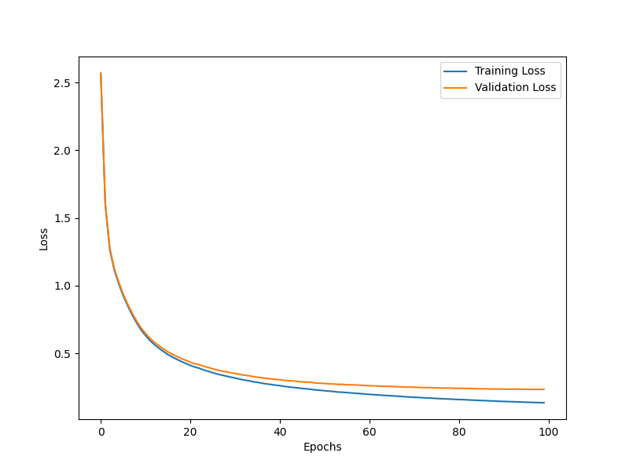

# *Feed Forward Neural Network* from scratch
In this assignment we had to implement a neural network from scratch and train it on the MNIST alphabet dataset. The trained model architecture and weights had to be saved for later use. The task was to
- Implement a feed forward neural network from scratch with support for
    - Dense Layers
    - Activation layers (ReLU, Sigmoid, Softmax, Tanh)
    - Initializers (Xavier, He, Lecun)
    - Dropout layers
    - Optimizers
- Build different Architectures and train them on the EMNIST dataset
- Report the performance of the models (Accuracy, Precision, Recall, F1 Score, Confusion Matrix)
- Save the model architecture and weights for later use

## Dataset
To download the training dataset, the following code was used:
```python
train_validation_dataset = ds.EMNIST(root='./data', split='letters',
train=True,
transform=transforms.ToTensor(),
download = True)
```
for downloading the test dataset, the following code was used:
```python
independent_test_set = ds.EMNIST(root='./data', split='letters',
train=False,
transform=transforms.ToTensor(),
download = True)
```
## Results 
### Architecture used
```
Dense Layer: (784,464)
Initializer:Xavier
Activation: Sigmoid
Dropout: 0.7

Dense Layer: (464,348)
Initializer:He
Activation: ReLU
Dropout: 0.52

Dense Layer: (348,26)
Initializer:Xavier
Activation: Softmax

Loss: Cross Entropy Loss
```

### Performance of the model
| Performance Measure | Value |
|---------------------|-------|
| Accuracy            | 95.29%|
| Validation Accuracy | 92.28%|
| Training Loss       | 0.135 |
| Validation Loss     | 0.233 |
| Validation Macro F1 | 0.922 |





### What I had to learn
* backpropagation from scratch
* importance of learning how to tune hyperparameters
* \_\_call\_\_, \_\_str\_\_ methods
* saving a model architecture along with it's weights
* how to avoid overfitting
