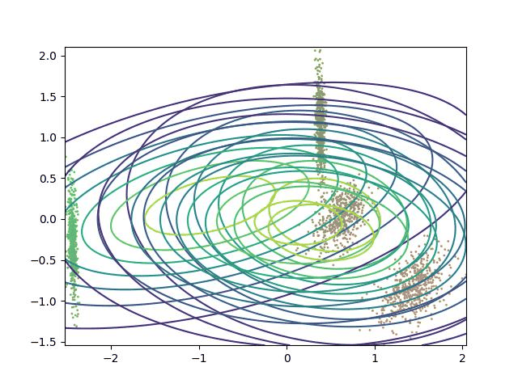
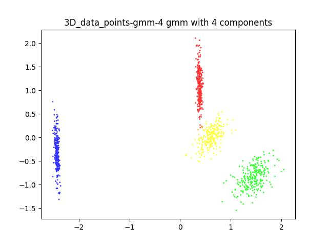
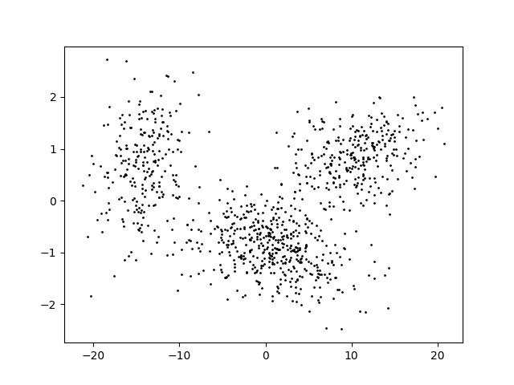
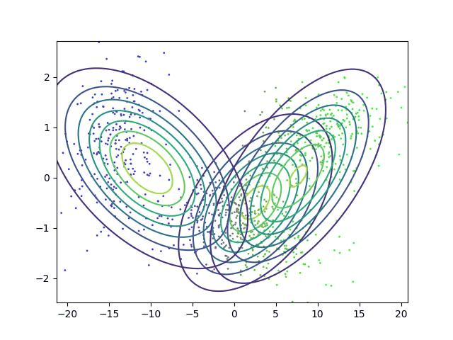
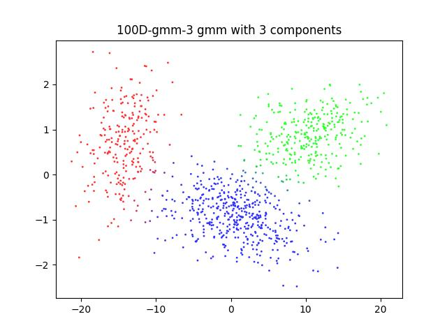

## *Principal Component Analysis* and *Expectation Maximization (EM) Algorithm* visualization
### Problem statement:
In this problem, we are given a dataset of **2, 3, 6 and 100 dimensional data** that was generated from a **gaussian mixture model**. \
The task was to 
- **apply Principal Component Analysis (PCA)** to the dataset and visualize the data in 2D. 
- **apply Expectation Maximization (EM) algorithm** on the 2 dimensional data to estimate the gaussian mixture model parameters used to generate the data.
    - The EM algorithm was implemented from scratch.
    - For each dataset, a guess was made for how many gaussian components were used to generate the data *from 3 to 8*
    - for each guessed number of components, the EM algorithm was run *5 times for 100 iterations* and the model with the highest log likelihood was chosen.
- **visualize the EM algorithm** by plotting the data and the estimated gaussian mixture model parameters at each iteration.

### Results
#### 2 Dimensional data
The dataset is in [this](data/2D_data_points_1.txt) folder.\
The PCA reduced 2D data points are shown below:

The visualization of the EM algorithm for *3 components* is shown below:

the resulting clusters after 100 iterations are shown below:

#### 3 Dimensional data
The dataset is in [this](data/3D_data_points.txt) folder.\
The PCA reduced 3D data points are shown below:

The visualization of the EM algorithm for *4 components* is shown below:

the resulting clusters after 100 iterations are shown below:

#### 6 Dimensional data
The dataset is in [this](data/6D_data_points.txt) folder.\
The PCA reduced 6D data points are shown below:

The visualization of the EM algorithm for *5 components* is shown below:

the resulting clusters after 100 iterations are shown below:

#### 100 Dimensional data
The dataset is in [this](data/100D.txt) folder.\
The PCA reduced 100D data points are shown below:

The visualization of the EM algorithm for *3 components* is shown below:

the resulting clusters after 100 iterations are shown below:

The other generated plots can be found in these links : 
1. [gifs](assets/gifs/).
2. [plots](assets/plots/).
3. [log-likehoods](assets/log_likelihoods/)

## Useful links
[A very good intro to SVD and PCA](https://web.stanford.edu/class/cs168/l/l9.pdf)